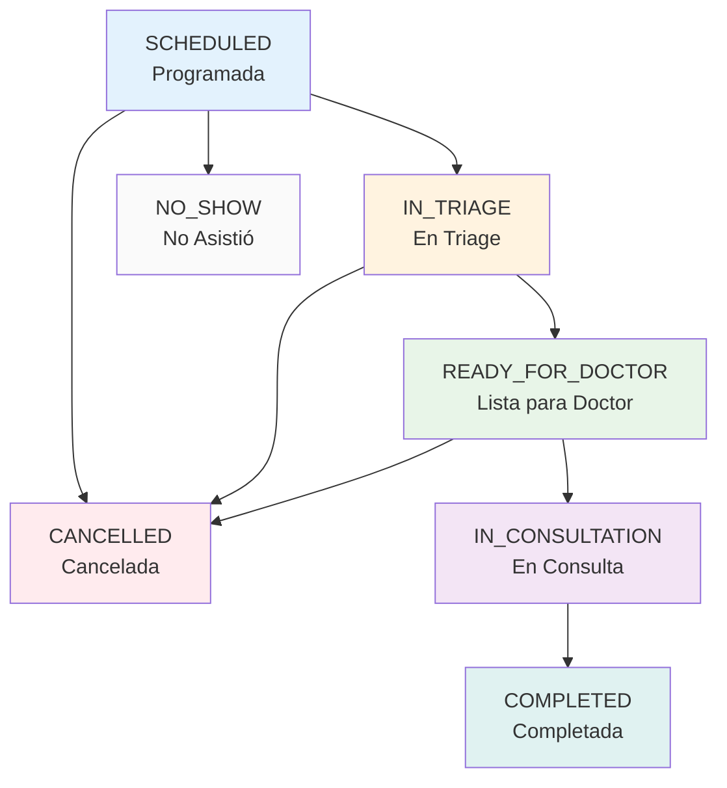
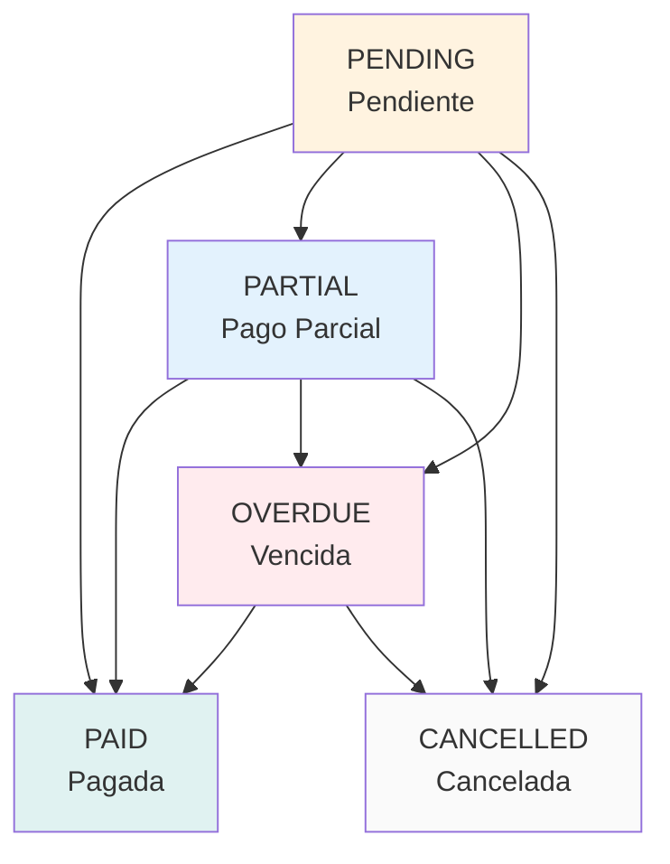
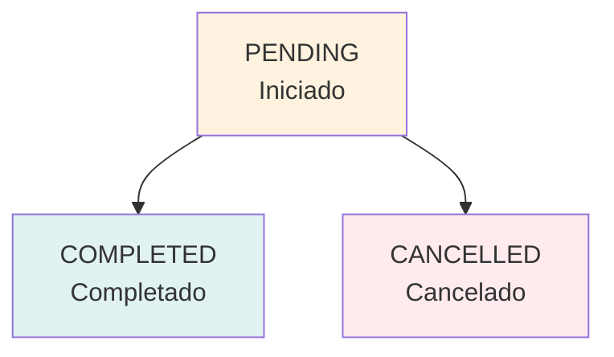
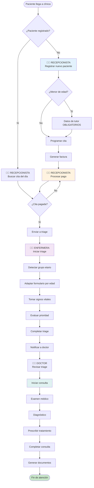
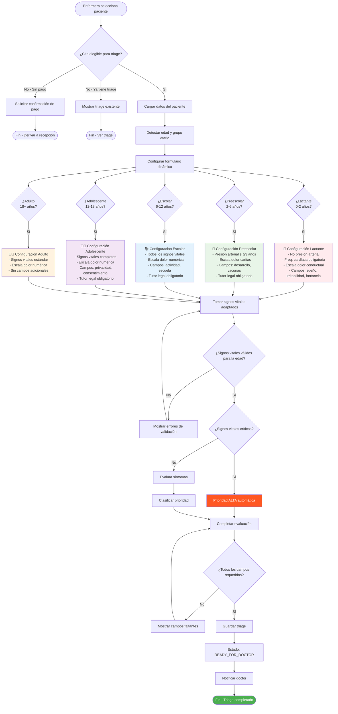
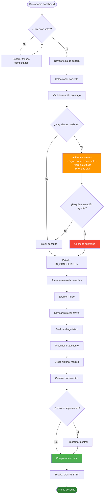

# 🏥 FLUJO DE TRABAJO DETALLADO - SISTEMA MÉDICO
## Documentación Completa del Sistema de Triage Adaptativo y Flujo de Trabajo Integrado

---

## 📋 ÍNDICE
1. [Visión General del Sistema](#visión-general-del-sistema)
2. [Flujo Principal de Atención](#flujo-principal-de-atención)
3. [Roles y Responsabilidades](#roles-y-responsabilidades)
4. [Sistema de Estados](#sistema-de-estados)
5. [Triage Adaptativo por Edad](#triage-adaptativo-por-edad)
6. [Validaciones y Reglas de Negocio](#validaciones-y-reglas-de-negocio)
7. [Casos Especiales y Excepciones](#casos-especiales-y-excepciones)
8. [Diagramas de Flujo](#diagramas-de-flujo)
9. [Documentación Técnica](#documentación-técnica)

---

## � VISIÓN GENERAL DEL SISTEMA

### **Objetivo Principal**
Sistema integral de gestión médica que automatiza el flujo completo de atención al paciente, desde el registro inicial hasta la consulta médica, con énfasis especial en el **triage pediátrico adaptativo** y la **coordinación enfermera-doctor**.

### **Arquitectura del Sistema**
```
Frontend (Flask Templates) ↔ Backend (Flask + SQLAlchemy) ↔ Base de Datos (SQLite)
│
├── Modelos de Datos: Patient, User, Appointment, Triage, MedicalRecord, Invoice
├── Rutas por Rol: admin, auth, doctor, nurse, receptionist, main
└── Templates Específicos: Por rol y funcionalidad
```

### **Principios de Diseño**
- **🎯 Adaptabilidad por Edad**: El sistema se ajusta automáticamente según el grupo etario del paciente
- **� Flujo Dirigido**: Cada paso del proceso está claramente definido y validado
- **🔒 Seguridad de Datos**: Validaciones en frontend y backend para datos médicos críticos
- **👥 Experiencia de Usuario**: Interfaces intuitivas específicas para cada rol profesional

### **Innovaciones Principales**
1. **Triage Pediátrico Adaptativo**: Campos y validaciones dinámicas según edad
2. **Flujo Enfermera-Doctor Integrado**: Estados de cita que conectan ambos roles
3. **Validaciones Médicas Específicas**: Rangos normales por grupo etario
4. **Dashboard Contextual**: Información relevante por rol y momento

---
- ✅ Gestión de signos vitales
- ✅ Clasificación de prioridades
- ✅ Vista de citas programadas del día

**Restricciones:**
- ❌ No puede modificar información del paciente
- ❌ No puede programar o cancelar citas
- ❌ No puede realizar diagnósticos
- ❌ No puede prescribir medicamentos

### **👨‍⚕️ DOCTOR (`doctor`)**
**Permisos:**
- ✅ Vista completa de triage de sus pacientes
- ✅ Realización de consultas médicas
- ✅ Creación y edición de historiales médicos
- ✅ Prescripción de medicamentos
- ✅ Generación de certificados médicos
- ✅ Vista de su agenda personalizada

**Restricciones:**
- ❌ No puede modificar información de facturación
- ❌ No puede crear o editar pacientes
- ❌ Solo ve sus propias citas y pacientes

---

## 🔄 **FLUJO PRINCIPAL: ATENCIÓN DE PACIENTE** {#flujo-principal}

### **FASE 1: REGISTRO Y PROGRAMACIÓN** 
```mermaid
RECEPCIONISTA
├── Buscar paciente existente (DNI/nombre)
├── Si NO existe → Crear nuevo paciente
│   ├── Validar datos obligatorios
│   ├── Si menor de edad → Datos de tutor OBLIGATORIOS
│   └── Guardar en base de datos
├── Si existe → Verificar datos actuales
├── Verificar disponibilidad de citas
├── Programar cita en horario disponible
├── Generar factura automáticamente
└── Estado inicial: CITA PROGRAMADA
```

### **FASE 2: FACTURACIÓN Y PAGO**
```mermaid
RECEPCIONISTA/PACIENTE
├── Verificar factura generada
├── Confirmar método de pago
├── Registrar pago en sistema
├── Validar pago completo
└── Estado: CITA PAGADA → Habilitada para triage
```

### **FASE 3: TRIAGE MÉDICO**
```mermaid
ENFERMERA
├── Verificar cita pagada y programada
├── Iniciar triage → Estado: EN TRIAGE
├── Evaluar signos vitales (adaptados por edad)
├── Registrar motivo de consulta y síntomas
├── Clasificar prioridad (alta/media/baja)
├── Completar evaluación
└── Estado: LISTA PARA DOCTOR
```

### **FASE 4: CONSULTA MÉDICA**
```mermaid
DOCTOR
├── Ver citas listas en dashboard
├── Revisar información de triage
├── Iniciar consulta → Estado: EN CONSULTA
├── Realizar anamnesis completa
├── Examen físico y diagnóstico
├── Prescribir tratamiento
├── Completar historial médico
└── Estado: CONSULTA COMPLETADA
```

---

## 👥 **PROCESOS DETALLADOS POR ROL** {#procesos-por-rol}

### **🏥 RECEPCIONISTA - Gestión de Pacientes y Citas**

#### **A. REGISTRO DE NUEVO PACIENTE**

**Datos Obligatorios Generales:**
- ✅ Nombre completo (mínimo 2 palabras)
- ✅ DNI (único, formato válido)
- ✅ Fecha de nacimiento
- ✅ Teléfono de contacto

**Validaciones Especiales:**
```python
# Validación de edad y tutor legal
if edad < 18:
    CAMPOS_OBLIGATORIOS_ADICIONALES = [
        'guardian_name',      # Nombre del tutor
        'guardian_dni',       # DNI del tutor
        'guardian_phone',     # Teléfono del tutor
        'guardian_relationship' # Parentesco
    ]
    
# Validación de DNI único
if Patient.query.filter_by(dni=dni).first():
    raise Error("DNI ya registrado en el sistema")

# Validación de formato de teléfono
if not re.match(r'^\d{9}$', phone):
    raise Error("Teléfono debe tener 9 dígitos")
```

#### **B. PROGRAMACIÓN DE CITAS**

**Proceso Step-by-Step:**
1. **Seleccionar Paciente:** Búsqueda por DNI o nombre
2. **Elegir Especialidad:** Lista de especialidades activas
3. **Seleccionar Doctor:** Doctores disponibles en esa especialidad
4. **Verificar Disponibilidad:** Horarios libres del doctor
5. **Confirmar Cita:** Generar cita con duración estándar
6. **Generar Factura:** Automática con precio de especialidad

**Validaciones de Programación:**
```python
# No permitir citas en el pasado
if fecha_cita < datetime.now():
    raise Error("No se pueden programar citas en el pasado")

# Verificar disponibilidad del doctor
if not doctor.is_available(fecha_cita, duracion):
    raise Error("Doctor no disponible en ese horario")

# Máximo 1 cita activa por paciente por día
citas_del_dia = Appointment.query.filter(
    Appointment.patient_id == patient_id,
    Appointment.date_time.date() == fecha_cita.date(),
    Appointment.status.in_(['scheduled', 'in_triage', 'ready_for_doctor'])
).count()

if citas_del_dia > 0:
    raise Error("Paciente ya tiene cita programada para este día")
```

#### **C. GESTIÓN DE PAGOS**

**Métodos de Pago Aceptados:**
- 💵 Efectivo
- 💳 Tarjeta de débito/crédito
- 🏦 Transferencia bancaria
- 🏥 Seguro médico

**Estados de Pago:**
- `pending` → Pendiente de pago
- `paid` → Pagado completamente
- `partial` → Pago parcial
- `overdue` → Vencido
- `cancelled` → Cancelado

**Validaciones de Pago:**
```python
# Verificar monto correcto
if monto_pagado != factura.total_amount:
    if monto_pagado < factura.total_amount:
        factura.status = 'partial'
        factura.paid_amount = monto_pagado
    else:
        raise Error("Monto pagado excede el total de la factura")

# Solo citas pagadas pueden ir a triage
def can_start_triage(appointment):
    return appointment.status == 'scheduled' and appointment.is_paid
```

---

### **👩‍⚕️ ENFERMERA - Sistema de Triage**

#### **A. SELECCIÓN DE PACIENTE PARA TRIAGE**

**Criterios de Elegibilidad:**
- ✅ Cita programada para hoy
- ✅ Pago confirmado
- ✅ Sin triage previo para esta cita
- ✅ Estado: `scheduled`

**Lista Priorizada:**
```python
# Orden de atención sugerido
1. Citas vencidas (pasadas de hora)
2. Citas de la hora actual
3. Próximas citas del día
```

#### **B. PROCESO DE TRIAGE ADAPTATIVO**

**Clasificación Automática por Edad:**
```python
def get_age_group(birth_date):
    age = calculate_age(birth_date)
    if age < 2:
        return 'lactante'      # 0-23 meses
    elif age < 6:
        return 'preescolar'    # 2-5 años
    elif age < 12:
        return 'escolar'       # 6-11 años
    elif age < 18:
        return 'adolescente'   # 12-17 años
    else:
        return 'adulto'        # 18+ años
```

**Signos Vitales por Grupo Etario:**

| **Grupo** | **Presión Arterial** | **Freq. Cardíaca** | **Temperatura** | **Peso/Altura** |
|-----------|---------------------|-------------------|-----------------|-----------------|
| **Lactantes (0-2)** | ❌ No aplicable | ✅ 100-160 bpm | ✅ 36.5-37.8°C | ✅ Obligatorio |
| **Preescolares (2-6)** | ⚠️ Si ≥3 años: 85-110/55-75 | ✅ 90-130 bpm | ✅ 36.0-37.5°C | ✅ Obligatorio |
| **Escolares (6-12)** | ✅ 90-120/60-80 mmHg | ✅ 70-110 bpm | ✅ 36.0-37.5°C | ✅ Obligatorio |
| **Adolescentes (12-18)** | ✅ 90-130/60-85 mmHg | ✅ 60-100 bpm | ✅ 36.0-37.5°C | ⚠️ Opcional |
| **Adultos (18+)** | ✅ 90-140/60-90 mmHg | ✅ 60-100 bpm | ✅ 36.0-37.5°C | ⚠️ Opcional |

**Campos Específicos por Edad:**

**🍼 LACTANTES:**
- Patrón de sueño (normal/inquieto/excesivo/pobre)
- Irritabilidad/Consolabilidad (tranquilo/leve/inconsolable)
- Fontanela - solo hasta 18 meses (normal/abombada/hundida/cerrada)
- Estado de alimentación (normal/mala tolerancia/vómitos/rechaza)

**👶 PREESCOLARES:**
- Desarrollo psicomotor (normal/retraso/avanzado)
- Vacunación al día (completa/incompleta/desconocida)

**📚 ESCOLARES:**
- Actividad física reciente (normal/limitada/ninguna)
- Rendimiento escolar (normal/ha declinado/no aplicable)

**🧑‍🎓 ADOLESCENTES:**
- Privacidad requerida (sí/no)
- Consentimiento del menor (dado/rechaza/pendiente)

**👨‍👩‍👧‍👦 MENORES DE EDAD (todos <18):**
- Tutor presente (sí/no/adulto autorizado) - **OBLIGATORIO**
- Autorización para tratamiento (dada/pendiente/emergencia) - **OBLIGATORIO**

#### **C. ESCALAS DE DOLOR ADAPTADAS**

**Por Grupo Etario:**
```python
# Lactantes (0-2 años) - Escala Conductual
DOLOR_LACTANTES = {
    0: "Sin dolor aparente",
    3: "Llanto leve/quejidos", 
    6: "Llanto intenso/irritabilidad",
    10: "Llanto inconsolable"
}

# Preescolares (2-6 años) - Escala de Caritas
DOLOR_PREESCOLARES = {
    0: "😊 Sin dolor",
    2: "😐 Poco dolor", 
    4: "😟 Duele un poco",
    6: "😣 Duele más",
    8: "😢 Duele mucho",
    10: "😭 Duele muchísimo"
}

# Escolares, Adolescentes, Adultos - Escala Numérica (0-10)
DOLOR_NUMERICO = {
    0: "Sin dolor",
    1-3: "Dolor leve",
    4-6: "Dolor moderado", 
    7-10: "Dolor severo"
}
```

#### **D. CLASIFICACIÓN DE PRIORIDAD**

**Criterios de Prioridad Alta:**
- 🔴 Signos vitales críticos fuera de rango
- 🔴 Dolor severo (8-10/10)
- 🔴 Síntomas de emergencia
- 🔴 Lactantes con llanto inconsolable
- 🔴 Dificultad respiratoria aparente

**Criterios de Prioridad Media:**
- 🟡 Signos vitales levemente alterados
- 🟡 Dolor moderado (4-7/10)
- 🟡 Síntomas molestos pero no urgentes
- 🟡 Consultas de control con síntomas nuevos

**Criterios de Prioridad Baja:**
- 🟢 Signos vitales normales
- 🟢 Sin dolor o dolor leve (0-3/10)
- 🟢 Consultas preventivas
- 🟢 Controles de rutina

**Validaciones Automáticas:**
```python
def classify_priority(triage):
    priority = 'baja'  # Default
    
    # Verificar signos vitales anormales
    abnormal_signs = triage.is_vital_signs_abnormal()
    if abnormal_signs:
        priority = 'alta'
    
    # Verificar dolor severo
    if triage.pain_scale and triage.pain_scale >= 8:
        priority = 'alta'
    elif triage.pain_scale and triage.pain_scale >= 4:
        priority = 'media'
    
    # Verificar síntomas críticos en motivo de consulta
    critical_symptoms = ['dificultad respirar', 'dolor pecho', 'fiebre alta']
    if any(symptom in triage.chief_complaint.lower() for symptom in critical_symptoms):
        priority = 'alta'
        
    return priority
```

---

### **👨‍⚕️ DOCTOR - Consulta Médica**

#### **A. DASHBOARD Y NOTIFICACIONES**

**Vista Priorizada del Doctor:**
1. **🔴 Citas Listas para Consulta** (triage completado)
2. **🟡 Citas En Triage** (en proceso)
3. **⚪ Citas Programadas** (pendientes de triage)
4. **📊 Estadísticas del día**

**Métricas en Tiempo Real:**
- Citas de hoy
- Citas en triage
- Citas listas para consulta
- Mis pacientes totales
- Próximas citas
- Consultas del mes

#### **B. REVISIÓN DE TRIAGE**

**Información Disponible para el Doctor:**
- ✅ **Datos del paciente:** Edad, grupo etario, tutor legal
- ✅ **Signos vitales completos:** Con indicadores de normalidad
- ✅ **Evaluación clínica:** Motivo, dolor, prioridad, alergias
- ✅ **Campos específicos por edad:** Adaptados al grupo etario
- ✅ **Observaciones de enfermería:** Notas adicionales
- ✅ **Alertas automáticas:** Signos vitales anormales destacados

**Alertas Automáticas:**
```html

<div class="alert alert-warning">
    <h5>⚠️ Signos Vitales Anormales Detectados</h5>
    <ul>
        
        <li>{{ sign.title() }}</li>
        
    </ul>
</div>

```

#### **C. INICIO DE CONSULTA**

**Validaciones Previas:**
```python
def can_start_consultation(appointment):
    # Debe ser cita del doctor actual
    if appointment.doctor_id != current_user.id:
        return False, "Cita no pertenece a este doctor"
    
    # Debe tener triage completado
    if appointment.status != 'ready_for_doctor':
        return False, "Cita no está lista para consulta"
    
    # Debe tener triage asociado
    if not appointment.has_triage():
        return False, "Cita no tiene triage asociado"
        
    return True, "OK"
```

**Transición de Estados:**
```python
# Al iniciar consulta
appointment.status = 'in_consultation'
consultation_start_time = datetime.now()

# Al completar consulta
appointment.status = 'completed'
consultation_end_time = datetime.now()
```

---

## ✅ **VALIDACIONES Y REGLAS DE NEGOCIO** {#validaciones}

### **🔒 VALIDACIONES DE SEGURIDAD**

#### **Validaciones de Acceso por Rol:**
```python
@require_role('nurse')
def triage_routes():
    # Solo enfermeras pueden hacer triage
    pass

@require_role('doctor') 
def consultation_routes():
    # Solo doctores pueden ver/iniciar consultas
    pass

@require_role(['admin', 'receptionist'])
def billing_routes():
    # Solo admin y recepcionistas manejan facturación
    pass
```

#### **Validaciones de Propiedad de Datos:**
```python
# Doctor solo ve sus propias citas
appointments = Appointment.query.filter_by(doctor_id=current_user.id)

# Enfermera solo edita triage que creó
if triage.nurse_id != current_user.id:
    raise Forbidden("No puede editar triage de otra enfermera")
```

### **📋 VALIDACIONES DE DATOS**

#### **Validaciones de Pacientes:**
```python
class PatientValidation:
    @staticmethod
    def validate_dni(dni):
        # DNI debe ser único y tener 8 dígitos
        if not re.match(r'^\d{8}$', dni):
            raise ValidationError("DNI debe tener 8 dígitos")
        
        existing = Patient.query.filter_by(dni=dni).first()
        if existing:
            raise ValidationError("DNI ya registrado")
    
    @staticmethod
    def validate_minor_fields(patient_data):
        age = calculate_age(patient_data['birth_date'])
        if age < 18:
            required_fields = ['guardian_name', 'guardian_dni', 'guardian_phone']
            missing = [f for f in required_fields if not patient_data.get(f)]
            if missing:
                raise ValidationError(f"Campos obligatorios para menores: {', '.join(missing)}")
```

#### **Validaciones de Citas:**
```python
class AppointmentValidation:
    @staticmethod
    def validate_scheduling(doctor_id, date_time, duration):
        # No citas en el pasado
        if date_time < datetime.now():
            raise ValidationError("No se pueden programar citas en el pasado")
        
        # Verificar disponibilidad del doctor
        conflicts = Appointment.query.filter(
            Appointment.doctor_id == doctor_id,
            Appointment.date_time < date_time + timedelta(minutes=duration),
            Appointment.date_time + timedelta(minutes=Appointment.duration) > date_time,
            Appointment.status.in_(['scheduled', 'in_triage', 'ready_for_doctor', 'in_consultation'])
        ).count()
        
        if conflicts > 0:
            raise ValidationError("Doctor no disponible en ese horario")
    
    @staticmethod
    def validate_triage_eligibility(appointment):
        if not appointment.is_paid:
            raise ValidationError(f"Cita debe estar pagada. Estado: {appointment.payment_status}")
        
        if appointment.status != 'scheduled':
            raise ValidationError(f"Cita debe estar programada. Estado actual: {appointment.status_label}")
```

#### **Validaciones de Triage:**
```python
class TriageValidation:
    @staticmethod
    def validate_vital_signs_by_age(patient, vital_signs):
        age_group = patient.age_group
        errors = []
        
        if age_group == 'lactante':
            # Lactantes: No presión arterial
            if vital_signs.get('systolic') or vital_signs.get('diastolic'):
                errors.append("Lactantes no requieren presión arterial")
            
            # Frecuencia cardíaca obligatoria
            hr = vital_signs.get('heart_rate')
            if not hr:
                errors.append("Frecuencia cardíaca es obligatoria para lactantes")
            elif not (100 <= hr <= 160):
                errors.append("Frecuencia cardíaca fuera del rango normal para lactantes (100-160 bpm)")
        
        elif age_group == 'preescolar':
            age = patient.age
            if age >= 3:
                # Mayores de 3 años requieren presión arterial
                if not vital_signs.get('systolic') or not vital_signs.get('diastolic'):
                    errors.append("Presión arterial obligatoria para preescolares mayores de 3 años")
        
        # Validaciones comunes
        temp = vital_signs.get('temperature')
        if temp and not (35.5 <= float(temp) <= 42.0):
            errors.append("Temperatura fuera del rango válido (35.5-42.0°C)")
        
        return errors
    
    @staticmethod
    def validate_required_fields_by_age(patient, triage_data):
        age_group = patient.age_group
        required_fields = ['chief_complaint']  # Base
        
        if age_group == 'lactante':
            required_fields.extend(['heart_rate', 'temperature', 'weight', 'height'])
        elif age_group in ['preescolar', 'escolar']:
            required_fields.extend(['heart_rate', 'temperature', 'weight', 'height'])
            if patient.age >= 3:
                required_fields.extend(['systolic', 'diastolic'])
        elif age_group in ['adolescente', 'adulto']:
            required_fields.extend(['systolic', 'diastolic', 'heart_rate', 'temperature'])
        
        # Verificar campos de tutor para menores
        if patient.is_minor:
            required_fields.extend(['guardian_present', 'treatment_authorization'])
        
        missing = [f for f in required_fields if not triage_data.get(f)]
        if missing:
            raise ValidationError(f"Campos requeridos para {patient.age_group_label}: {', '.join(missing)}")
```

### **⚠️ VALIDACIONES DE BUSINESS LOGIC**

#### **Flujo de Estados:**
```python
class StateTransitionValidation:
    VALID_TRANSITIONS = {
        'scheduled': ['in_triage', 'cancelled', 'no_show'],
        'in_triage': ['ready_for_doctor', 'cancelled'],
        'ready_for_doctor': ['in_consultation', 'cancelled'],
        'in_consultation': ['completed'],
        'completed': [],  # Estado final
        'cancelled': [],  # Estado final
        'no_show': []     # Estado final
    }
    
    @staticmethod
    def can_transition(current_status, new_status):
        valid_next = StateTransitionValidation.VALID_TRANSITIONS.get(current_status, [])
        return new_status in valid_next
    
    @staticmethod
    def validate_transition(appointment, new_status):
        if not StateTransitionValidation.can_transition(appointment.status, new_status):
            raise ValidationError(
                f"Transición inválida: {appointment.status_label} → {new_status}"
            )
```

#### **Validaciones de Tiempo:**
```python
class TimeValidation:
    @staticmethod
    def validate_consultation_window():
        # Solo se pueden hacer consultas en horario laboral
        now = datetime.now()
        if now.hour < 8 or now.hour > 18:
            raise ValidationError("Consultas solo permitidas en horario laboral (8:00-18:00)")
        
        # No consultas en fines de semana (opcional)
        if now.weekday() >= 5:  # Sábado=5, Domingo=6
            raise ValidationError("No se permiten consultas en fines de semana")
    
    @staticmethod
    def validate_triage_timing(appointment):
        # Triage solo el día de la cita
        appointment_date = appointment.date_time.date()
        today = datetime.now().date()
        
        if appointment_date != today:
            raise ValidationError("Triage solo puede realizarse el día de la cita")
        
        # No triage después de la cita (con tolerancia de 1 hora)
        if datetime.now() > appointment.date_time + timedelta(hours=1):
            raise ValidationError("Triage debe realizarse antes o máximo 1 hora después de la cita")
```

---

## 🔄 **ESTADOS Y TRANSICIONES** {#estados}

### **📋 ESTADOS DE CITA**



**Descripción de Estados:**

| Estado | Descripción | Puede Transicionar A | Responsable |
|--------|-------------|---------------------|-------------|
| `scheduled` | Cita programada y pagada | `in_triage`, `cancelled`, `no_show` | Recepcionista |
| `in_triage` | Enfermera realizando triage | `ready_for_doctor`, `cancelled` | Enfermera |
| `ready_for_doctor` | Triage completado, listo para consulta | `in_consultation`, `cancelled` | Sistema |
| `in_consultation` | Doctor atendiendo al paciente | `completed` | Doctor |
| `completed` | Consulta finalizada | Ninguno (final) | Doctor |
| `cancelled` | Cita cancelada | Ninguno (final) | Cualquiera |
| `no_show` | Paciente no asistió | Ninguno (final) | Recepcionista |

### **💳 ESTADOS DE FACTURA**



### **🏥 ESTADOS DE TRIAGE**



---

## 🚨 **CASOS ESPECIALES Y EXCEPCIONES** {#casos-especiales}

### **👶 PACIENTES MENORES DE EDAD**

#### **Validaciones Especiales:**
```python
class MinorPatientRules:
    @staticmethod
    def validate_guardian_presence(triage_data):
        guardian_present = triage_data.get('guardian_present')
        if guardian_present == 'no':
            # Verificar si hay adulto autorizado
            auth_adult = triage_data.get('authorized_adult_present')
            if not auth_adult:
                raise ValidationError(
                    "Menor de edad debe estar acompañado por tutor legal o adulto autorizado"
                )
    
    @staticmethod
    def validate_treatment_authorization(patient, triage_data):
        authorization = triage_data.get('treatment_authorization')
        if authorization == 'pending':
            # Solo procedimientos de emergencia
            if triage_data.get('priority_level') != 'alta':
                raise ValidationError(
                    "Sin autorización del tutor, solo se permiten atenciones de emergencia"
                )
        elif authorization == 'emergency':
            # Documentar situación de emergencia
            if not triage_data.get('emergency_justification'):
                raise ValidationError(
                    "Debe documentar justificación de atención de emergencia sin tutor"
                )
```

#### **Campos Adicionales Requeridos:**
- ✅ Presencia del tutor (obligatorio)
- ✅ Autorización para tratamiento (obligatorio)
- ✅ Relación con el menor (padre/madre/abuelo/tío/autorizado)
- ✅ DNI del acompañante (si no es el tutor registrado)

### **🔴 EMERGENCIAS MÉDICAS**

#### **Protocolo de Emergencia:**
```python
class EmergencyProtocol:
    EMERGENCY_INDICATORS = [
        'dificultad_respiratoria_severa',
        'dolor_pecho_intenso', 
        'perdida_consciencia',
        'hemorragia_activa',
        'convulsiones',
        'shock_anafilactico'
    ]
    
    @staticmethod
    def handle_emergency_case(triage):
        # Prioridad automática ALTA
        triage.priority_level = 'alta'
        
        # Notificación inmediata al doctor
        send_emergency_notification(triage.appointment.doctor)
        
        # Bypass de validaciones menores
        triage.allow_incomplete_data = True
        
        # Documentación obligatoria
        triage.emergency_notes_required = True
        
        return triage
```

#### **Validaciones Relajadas en Emergencias:**
- ⚠️ Se permite triage incompleto si es necesario
- ⚠️ Se puede omitir autorización de tutor (con documentación)
- ⚠️ Prioridad automática ALTA
- ⚠️ Notificación inmediata al doctor

### **💊 PACIENTES CON ALERGIAS CRÍTICAS**

#### **Alertas Automáticas:**
```python
class AllergyAlert:
    CRITICAL_ALLERGIES = [
        'penicilina', 'latex', 'mariscos', 'nueces', 
        'aspirina', 'anestesia', 'yodo'
    ]
    
    @staticmethod
    def check_critical_allergies(allergies_text):
        if not allergies_text:
            return []
        
        critical_found = []
        allergies_lower = allergies_text.lower()
        
        for allergy in AllergyAlert.CRITICAL_ALLERGIES:
            if allergy in allergies_lower:
                critical_found.append(allergy)
        
        return critical_found
    
    @staticmethod
    def generate_allergy_alert(critical_allergies):
        if critical_allergies:
            return {
                'level': 'CRITICAL',
                'message': f'⚠️ ALERGIAS CRÍTICAS: {", ".join(critical_allergies).upper()}',
                'color': 'red',
                'requires_confirmation': True
            }
        return None
```

### **🕐 CITAS FUERA DE HORARIO**

#### **Manejo de Casos Especiales:**
```python
class SpecialScheduling:
    @staticmethod
    def handle_after_hours_appointment(appointment):
        # Citas de emergencia fuera de horario
        if appointment.is_emergency:
            appointment.status = 'emergency_scheduled'
            appointment.requires_emergency_fee = True
            return True
        
        # Citas normales fuera de horario - no permitidas
        raise ValidationError("No se permiten citas regulares fuera del horario laboral")
    
    @staticmethod
    def handle_same_day_appointment(appointment):
        # Mismo día requiere validaciones especiales
        if appointment.date_time.date() == datetime.now().date():
            # Verificar si es posible
            time_until_appointment = appointment.date_time - datetime.now()
            if time_until_appointment < timedelta(hours=2):
                # Menos de 2 horas - notificar urgencia
                send_urgent_appointment_notification(appointment.doctor)
        
        return appointment
```

### **💔 CITAS CANCELADAS O NO SHOW**

#### **Políticas de Cancelación:**
```python
class CancellationPolicy:
    @staticmethod
    def validate_cancellation(appointment, cancellation_time):
        time_until_appointment = appointment.date_time - cancellation_time
        
        if time_until_appointment < timedelta(hours=2):
            # Cancelación tardía - puede generar cargo
            return {
                'allowed': True,
                'penalty': True,
                'message': 'Cancelación tardía. Se aplicará cargo del 50%.'
            }
        elif time_until_appointment < timedelta(hours=24):
            # Cancelación el mismo día
            return {
                'allowed': True,
                'penalty': False,
                'message': 'Cancelación el mismo día registrada.'
            }
        else:
            # Cancelación con tiempo suficiente
            return {
                'allowed': True,
                'penalty': False,
                'message': 'Cancelación procesada sin cargos.'
            }
    
    @staticmethod
    def handle_no_show(appointment):
        # Marcar como no show
        appointment.status = 'no_show'
        appointment.no_show_time = datetime.now()
        
        # Política de no shows
        patient_no_shows = Appointment.query.filter_by(
            patient_id=appointment.patient_id,
            status='no_show'
        ).count()
        
        if patient_no_shows >= 3:
            # Paciente con 3+ no shows - requerir prepago
            appointment.patient.requires_prepayment = True
            send_no_show_warning(appointment.patient)
        
        return appointment
```

---

## 📊 **DIAGRAMAS DE FLUJO** {#diagramas}

### **🔄 FLUJO COMPLETO DE ATENCIÓN**



### **🩺 FLUJO DETALLADO DE TRIAGE**



### **👨‍⚕️ FLUJO DE CONSULTA MÉDICA**



---

## 📝 **RESUMEN DE IMPLEMENTACIÓN**

### **✅ FUNCIONALIDADES COMPLETAMENTE IMPLEMENTADAS:**

1. **🏥 Sistema de Roles y Permisos**
   - 4 roles diferenciados con permisos específicos
   - Validaciones de acceso por decoradores
   - Restricciones de datos por rol

2. **👥 Gestión de Pacientes**
   - Registro con validaciones de DNI único
   - Campos obligatorios para menores de edad
   - Información de tutor legal completa

3. **📅 Sistema de Citas**
   - Programación con validación de disponibilidad
   - Estados inteligentes con transiciones controladas
   - Integración con facturación obligatoria

4. **💳 Facturación y Pagos**
   - Estados de pago detallados
   - Validación de pago antes de triage
   - Control de flujo pago → triage → consulta

5. **🩺 Sistema de Triage Adaptativo**
   - Clasificación automática por edad
   - Formularios dinámicos por grupo etario
   - Signos vitales adaptados con validaciones médicas
   - Escalas de dolor diferenciadas
   - Campos específicos por edad
   - Clasificación automática de prioridad

6. **👨‍⚕️ Dashboard del Doctor**
   - Vista priorizada de citas listas
   - Métricas en tiempo real
   - Revisión completa de triage
   - Integración con consulta médica

7. **🔄 Flujo de Trabajo Completo**
   - Estados bien definidos y controlados
   - Transiciones válidas únicamente
   - Validaciones en cada paso
   - Notificaciones entre roles

### **⚠️ VALIDACIONES CRÍTICAS IMPLEMENTADAS:**

- ✅ **Seguridad:** Acceso por roles, propiedad de datos
- ✅ **Datos:** DNI único, campos obligatorios por edad, formatos válidos  
- ✅ **Médicas:** Signos vitales por grupo etario, rangos normales
- ✅ **Flujo:** Estados válidos, transiciones controladas
- ✅ **Tiempo:** Horarios laborales, ventanas de atención
- ✅ **Especiales:** Menores de edad, emergencias, alergias críticas

### **🚀 SISTEMA LISTO PARA:**

- ✅ **Uso en producción** con datos reales
- ✅ **Múltiples usuarios** concurrentes
- ✅ **Flujo médico profesional** completo
- ✅ **Expansión futura** con nuevas funcionalidades

---

*Documento generado el 04 de julio de 2025*  
*Sistema Médico - Versión 2.4*  
*Estado: Producción Ready* ✅
